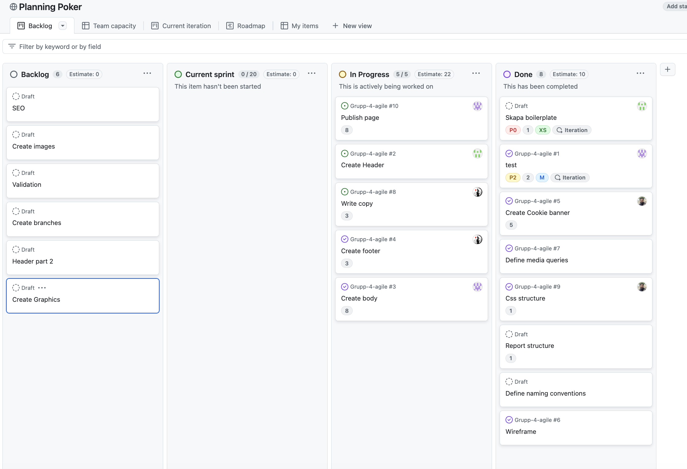
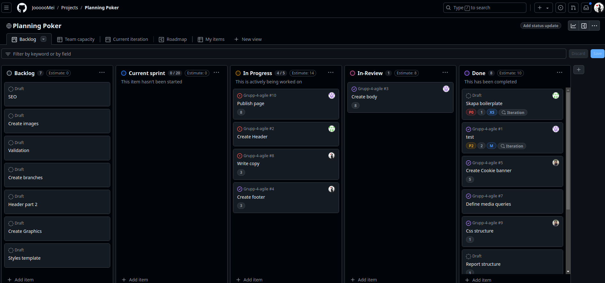
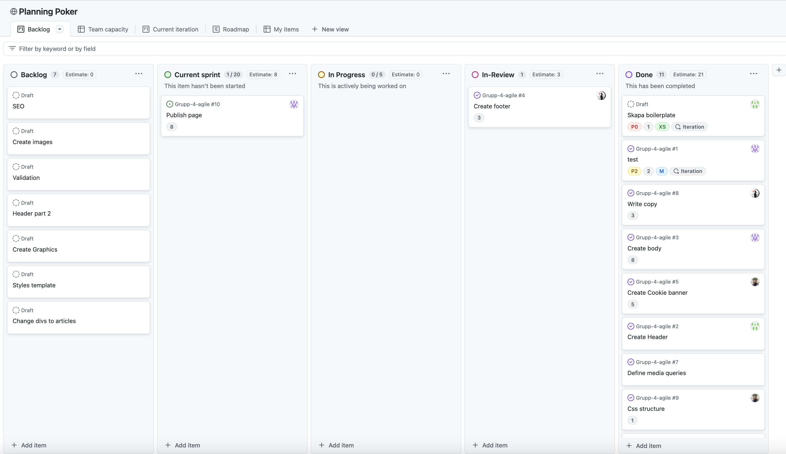
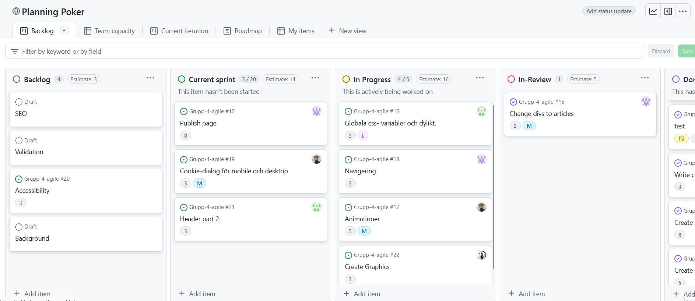
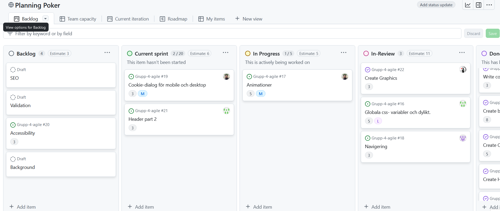
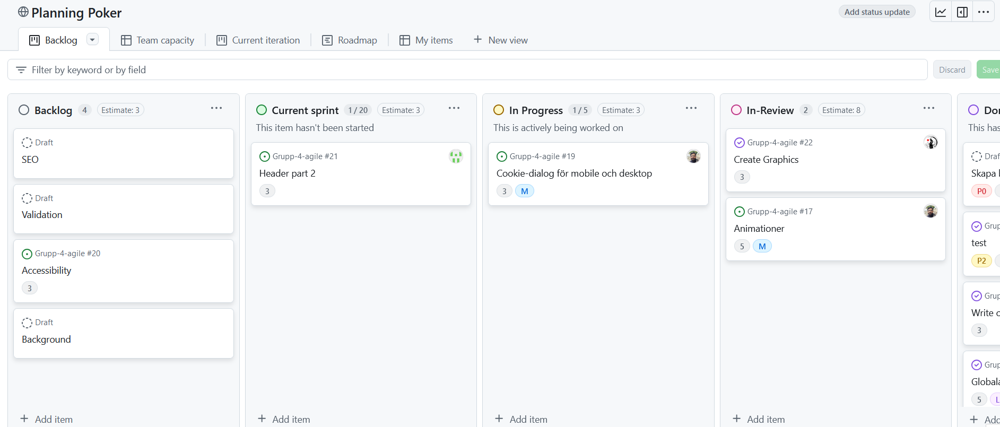
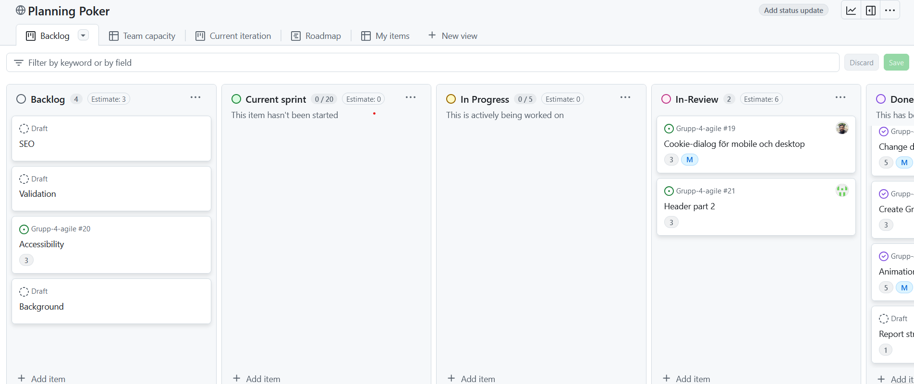
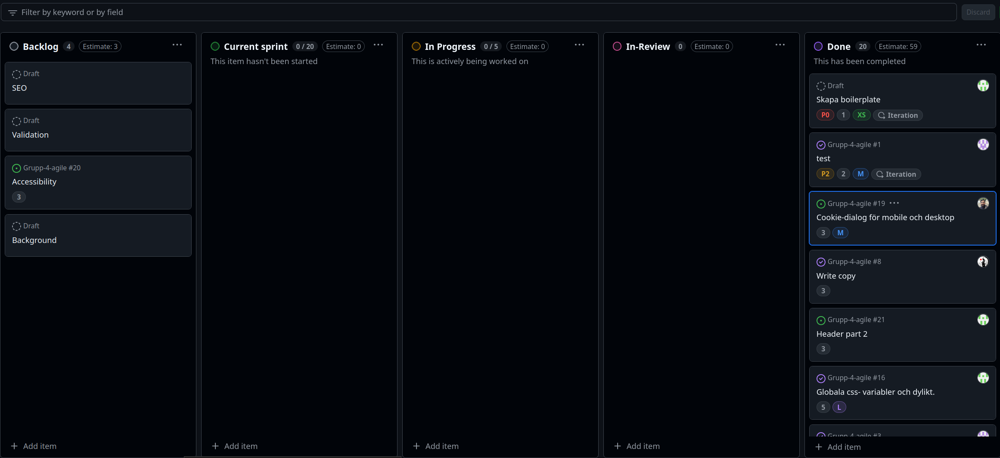
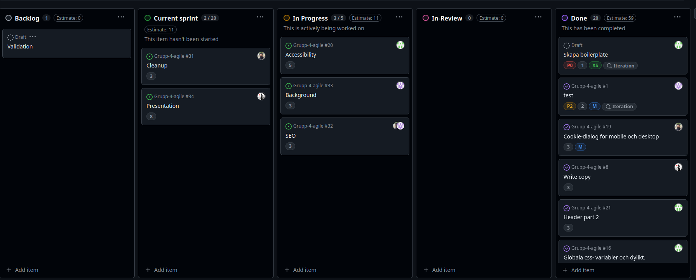

## 11/19/24

__________________________________________________
# What did we accomplish?

Break down the project into tasks.
Create a wireframe
Defined media queries.
Decided on rapporting structure.
Created a planning poker.
Align as a team.
Assigned tasks

__________________________________________________

# What is our goal?

Doing sprint planning.
Define the tasks:
    Create header (5) 2 dagar
    Create body (8) 1 vecka
    Create footer (3) 1 dag
    Create cookie banner (5)
    Validation ()
    Write copy (3)

__________________________________________________

# Team Summary:

Improving our planning poker.
Creating a sprint planning.
Learned to create issues in sprint planning.

======================================================

## 11/20/24

__________________________________________________
# What did we accomplish?

David completed writing 'WriteCopy'.
Hannes created a frame for the body of the site (desktop).
Mansoor created the cookie banner. Did a hot-fix in the CSS.
Johan did the header (desktop). Things left to do on mobile.

__________________________________________________

# What is our goal?

David will do footer (mobile)
Hannes will start on the body (mobile)
Mansoor looking to do structure to media query
Johan finishing the header

__________________________________________________

# Team Summary:

=============================================================

## 11/21/24

__________________________________________________
# What did we accomplish?

David completed a basic footer (mobile)
Hannes created a branch for body (mobile)
Mansoor - chilling
Johan header completed (mobile + desktop)

__________________________________________________

# What is our goal?

David improving the SASS for the footer (mobile)
Hannes improving on the main body
Johan creating a pull request
Mansoor doing a code review on the pull request

__________________________________________________

# Team Summary:

We are keeping a good pace!

=============================================================

## 11/22/24

__________________________________________________
# What did we accomplish?

David chilling.
Hannes finished doing the main body
Johan chillin. Did a pull request and merge
Mansoor research on git branch optimization

Everybody did a code review (pull request)

__________________________________________________

# What is our goal?

Today will be improving the SASS for the footer (mobile)
Code review on Hannes' code.
Going to do our retro.

__________________________________________________

## 11/25/24

__________________________________________________
# What did we accomplish?

David completed footer (desktop/mobile)
Hannes problem-shooting media-queries
Johan did fixes on Hannes' code
Mansoor did trouble-shooting and code-review

__________________________________________________

# What is our goal?

Make a new sprint-planning.
Merging the footer.
Create a DEV branch.
Exchanging the divs for semantic syntax

__________________________________________________

# Team Summary:

## 11/26/24

__________________________________________________
# What did we accomplish?

David R&D.
Hannes fixed semantic tags for html.
Mansoor Started with animations
Johan Branch for header, JS experimentation and style-template.

__________________________________________________

# What is our goal?

David Create graphics.
Hannes Finish scrolling and links.
Mansoor Work on animations
Johan Finish style-template

__________________________________________________

# Team Summary:

## 11/27/24

__________________________________________________
# What did we accomplish?

David finished graphics & footer.
Hannes finished scrolling and accessibility.
Mansoor R&D.
Johan finished style-template.
__________________________________________________

# What is our goal?

David R&D.
Hannes R&D & documentation.
Mansoor Animations and documentation.
Johan Header.

__________________________________________________

# Team Summary:

## 11/28/24

__________________________________________________
# What did we accomplish?

David R&D
Hannes R&D
Mansoor Animations
Johan Header
__________________________________________________

# What is our goal?

David Finish up things.
Hannes Finish up things.
Mansoor Merge animations and cookie-task.
Johan Finish header.

__________________________________________________

# Team Summary:

## 11/29/24

__________________________________________________
# What did we accomplish?

David added btc timestamps to index.html.
Hannes R&D small fixes.
Mansoor Cookie dialouge.
Johan Finished header.
__________________________________________________

# What is our goal?

David R&D.
Hannes Insert copy and images in index.html. Fix timeline-tree.
Mansoor Merge-conflicts and R&D.
Johan R&D.

__________________________________________________

# Team Summary:

## 12/02/24

__________________________________________________
# What did we accomplish?

David: R&D and rested for the new sprint
Johan: R&D and rested for the new sprint
Mansoor: R&D and rested for the new sprint
Hannes: R&D and rested for the new sprint

__________________________________________________

# What is our goal?

As a team: Complete our third and last sprint planning, finnish up the backlog and work on our presentation. 

__________________________________________________

# Team Summary:

## 12/03/24

__________________________________________________
# What did we accomplish?

David: Made the first draft of the powerpoint presentation (petcha kucha)
Johan: Worked hard on a11y, solved issue regarding screen readers.
Hannes: worked on and solved paralax and adjusted scroll anchors
Mansoor: R&D and created a branch for issue 

__________________________________________________

# What is our goal?

David: Finish up presentation so that the team can rehears tomorrow 
Johan: Will finish up a11y, if finished early, Johan will look into SEO
Hannes: Will start working on structured data
Mansoor: will update meta tags and finish the cleanup task 

__________________________________________________

# Team Summary:

