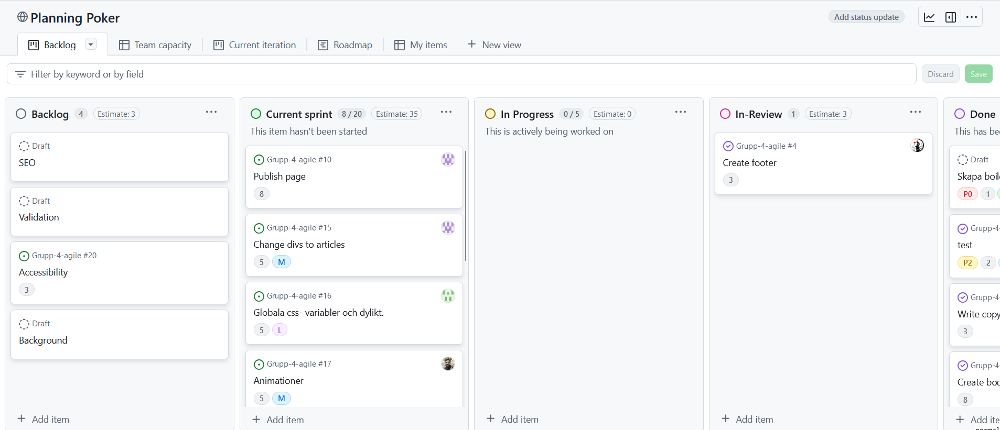
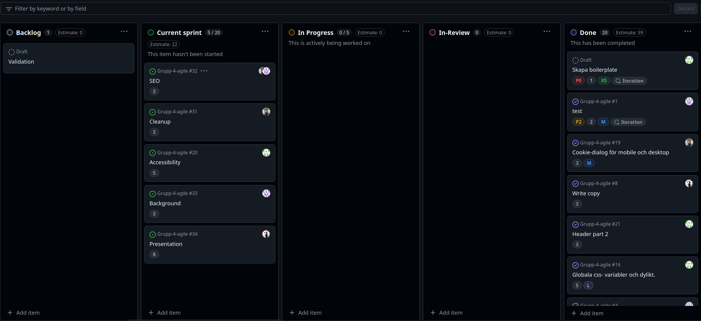

## 11/19/24
_____________________________________________

# Sprint Duration

One week

All the tasks are in the to-do column
We have defined each task
We have estimated the time for each task
We have assigned the tasks related to the current sprint

Doing sprint planning.
Define the tasks:
    Create header (5) 2 dagar
    Create body (8) 1 vecka
    Create footer (3) 1 dag
    Create cookie banner (5)
    Validation ()
    Write copy (3)

# =====================================================

## 11/25/24
_____________________________________________

One week

All the tasks are in the current-sprint column
We have defined each task
We have estimated the time for each task
We have assigned the tasks related to the current sprint

Cleaned up backlog by removing redundant tasks and redefining tasks

## 12/02/24
_____________________________________________

Added presentation and cleanup task to backlog.
Assigned all backlog tasks to the current sprint, except for Validation which will be divided amongst the team later in the sprint. 

